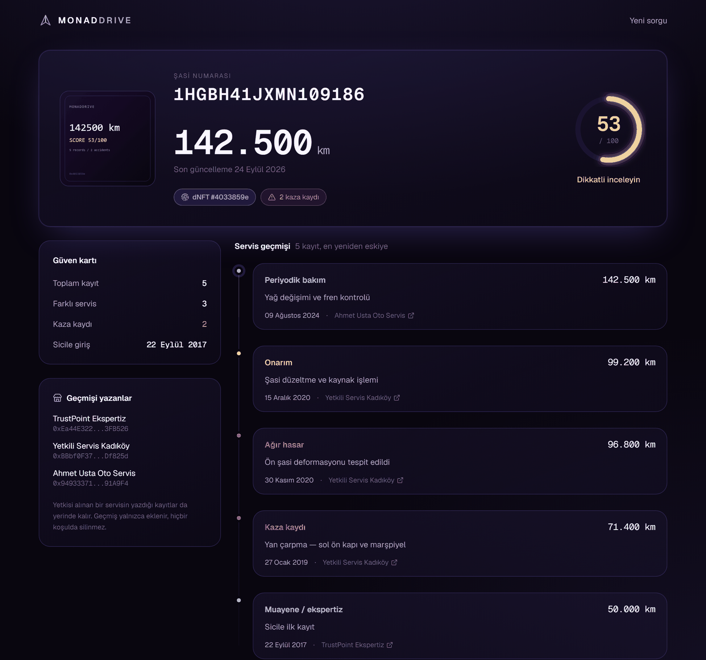
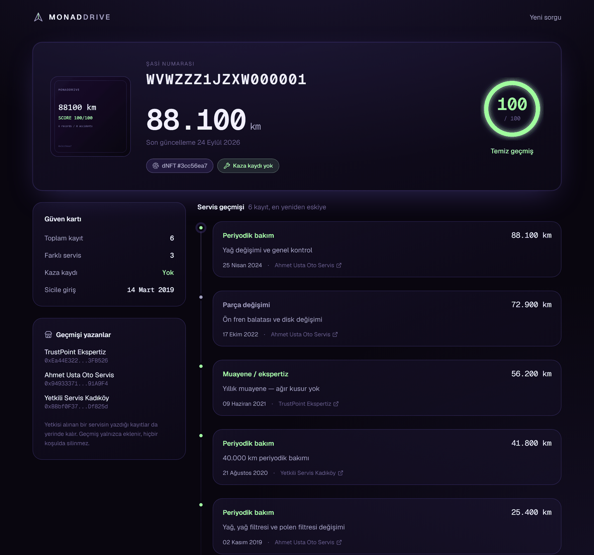
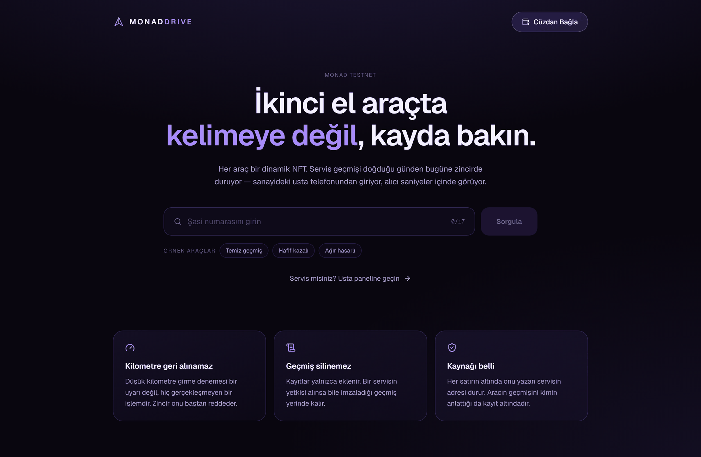
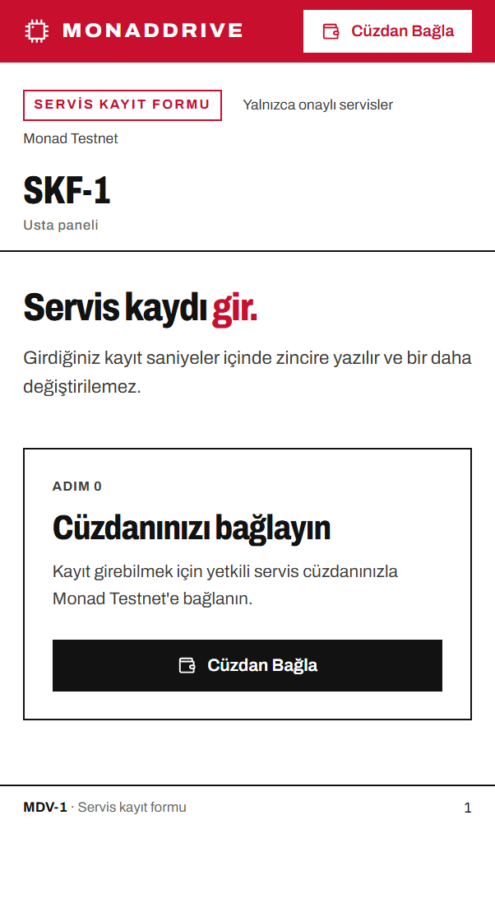

<div align="center">

# MonadDrive

**İkinci el araçta kelimeye değil, kayda bakın.**

Her araç bir dinamik NFT. Servis geçmişi zincirde, kilometre geri alınamıyor.

[](https://monad.xyz)
[](https://testnet.monadexplorer.com/address/0x08856cd65ba4d9d6c7b76886406c16a0e7664571)
[](#testler)
[](https://sourcify.dev/server/repo-ui/10143/0x08856cd65ba4d9d6c7b76886406c16a0e7664571)
[](https://nextjs.org)
[](https://soliditylang.org)

</div>

**Hızlı geçiş:** [Problem](#problem) · [Ne yapıyor](#ne-yapıyor) · [Ekranlar](#ekranlar) ·
[Canlı kontrat](#canlı-kontrat) · [Deneyin](#deneyin) · [Mimari](#mimari) ·
[İki değişmez](#ürünü-taşıyan-iki-değişmez) · [Tasarım kararları](#tasarım-kararları) ·
[Testler](#testler) · [Yerelde çalıştırma](#yerelde-çalıştırma) ·
[Güven varsayımları](#güven-varsayımları) · [Yol haritası](#yol-haritası)

---

## Problem

İkinci el araç alırken elinizde iki şey var: satıcının anlattıkları ve gösterge
panelindeki rakam. İkisi de değiştirilebilir.

Kilometre düşürmek bir kablo ve birkaç dakika meselesi. Kaza geçmişi, aracın
servis dosyasıyla birlikte kaybolabiliyor. Ekspertiz raporu aracın o günkü halini
anlatıyor — geçmişini değil. Alıcı, hayatının ikinci en büyük alışverişini
doğrulayamadığı bir anlatıya güvenerek yapıyor.

Sorun veri eksikliği değil. Veri var: her bakım bir serviste, her kaza bir
tutanakta kayıtlı. Sorun bu kayıtların **dağınık, silinebilir ve sahibinin
kontrolünde** olması.

## Ne yapıyor

MonadDrive her aracı tek bir ERC-721 token'ı olarak temsil ediyor. Token kimliği
şasi numarasından türüyor, yani camdaki numarayı bilen herkes aracın tüm
geçmişini sorgulayabiliyor — cüzdan kurmadan, kayıt olmadan, kimseden izin
almadan.

Sanayideki usta işi bitirdiğinde telefonundan kaydı giriyor: şasi no, kilometre,
işlem tipi, tarih, isterse fotoğraf. Kayıt bir saniyenin altında zincire yazılıyor
ve bir daha değiştirilemiyor.

Monad'ın sub-second finality'si burada süs değil, ürünün ön şartı: bir ustanın
müşteriyi bekletirken blok onayı için 15 saniye beklemesi gerekiyorsa o sistem
sanayide kullanılmaz.

## Ekranlar

### Alıcı sorgulama paneli

Şasi numarasıyla açılıyor, cüzdan istemiyor. Aracın zincirde üretilen NFT
görseli, güncel kilometresi, sağlık skoru ve doğduğu günden bugüne dikey zaman
çizelgesi. Her kaydın altında onu imzalayan servisin adı.



Aynı panel, temiz geçmişli bir araçta:



### Giriş



### Usta / servis paneli

Mobil odaklı, tek kolon, tek buton. Sanayide tek elle tutulan bir telefon için.

<div align="center">
  
</div>

> Arayüz Türkçe: ürün Türkiye'deki ikinci el araç piyasasını hedefliyor ve
> kullanıcısı sanayideki usta. Kod ve yorumlar İngilizce.

## Canlı kontrat

| | |
|---|---|
| **Ağ** | Monad Testnet (chainId `10143`) |
| **Sicil kontratı** | [`0x08856cd65ba4d9d6c7b76886406c16a0e7664571`](https://testnet.monadexplorer.com/address/0x08856cd65ba4d9d6c7b76886406c16a0e7664571) |
| **RPC** | `https://testnet-rpc.monad.xyz` |
| **Explorer** | [testnet.monadexplorer.com](https://testnet.monadexplorer.com) |
| **Doğrulanmış kaynak** | [Sourcify](https://sourcify.dev/server/repo-ui/10143/0x08856cd65ba4d9d6c7b76886406c16a0e7664571) — kontratı okuyup buradaki iddiaları kendiniz kontrol edebilirsiniz |

Zincirde şu an üç demo aracı ve 17 gerçek kayıt duruyor.

## Deneyin

Sorgulama paneli cüzdan istemiyor. Şu şasi numaralarını deneyin:

| Şasi numarası | Ne göreceksiniz |
|---|---|
| `WVWZZZ1JZXW000001` | Bakımlı, kazasız — skor **100**, 6 kayıt |
| `NM0GE9F79E1234567` | Hafif kazalı — skor **86**, 1 kaza |
| `1HGBH41JXMN109186` | Ağır hasarlı — skor **53**, 2 kaza, şasi deformasyonu |
| başka bir şey | Sicilde olmayan araç ekranı |

Kayıt girmek için cüzdanınızın yetkili servis olarak onaylanmış olması gerekiyor
(aşağıda [yerelde çalıştırma](#yerelde-çalıştırma)).

## Mimari

```
┌────────────────────────┐        ┌──────────────────────────┐
│  Usta paneli (mobil)   │        │ Alıcı paneli (masaüstü)  │
│  /report               │        │ /vehicle/[vin]           │
│  wagmi · cüzdan gerekli│        │ sunucuda okuma · cüzdansız│
└───────────┬────────────┘        └────────────┬─────────────┘
            │ addRecordByVin()                 │ multicall3 ile
            │ (imzalı işlem)                   │ tek eth_call
            │                                  │
      ┌─────▼──────────────────────────────────▼─────┐
      │        VehicleRegistry.sol                   │
      │   ERC-721 · Record[] · skor · servis yetkisi │
      │   tokenId = keccak256(şasi no)               │
      └──────────────────────┬───────────────────────┘
                             │ ipfsCid
                     ┌───────▼────────┐
                     │  IPFS (Pinata) │  fotoğraf ve fatura
                     └────────────────┘
```

**Neden `tokenId = keccak256(şasi no)`:** Alıcı, zincir dışı hiçbir dizine
ihtiyaç duymadan camdaki numarayla aracı buluyor. Şasi numarasının kendisi
zincire hiç yazılmıyor, yalnızca özeti tutuluyor. Aynı araç iki kez kaydedilemiyor
— ERC-721 zaten reddediyor.

**Neden subgraph yok:** Kontrat `getVehicleSummary` ve `getRecords` view'leri ile
bir sayfanın ihtiyacı olan her şeyi veriyor. Monad testnet'te Multicall3 deploy
edilmiş durumda, bu yüzden özet, kayıtlar, NFT görseli ve her servisin adı tek bir
`eth_call` içinde geliyor. Hackathon süresinde indexer kurmak tuzak.

## Ürünü taşıyan iki değişmez

Projenin tamamı iki kurala dayanıyor. Geri kalan her şey bu ikisinin sunumu.

### 1. Kilometre geri alınamaz

```solidity
if (mileage < v.lastMileage) revert MileageRollback(v.lastMileage, mileage);
```

Düşük kilometre girme denemesi bir uyarı, bir bayrak veya sonradan fark edilecek
bir tutarsızlık değil — **hiç gerçekleşmeyen bir işlem.** Zincir onu baştan
reddediyor, kayıt defterine hiç girmiyor.

### 2. Hasar puanı azalmaz

Kaza ve ağır hasar kayıtları kalıcı hasar puanı ekliyor. Düzenli bakım puan
kazandırıyor ama **en fazla 10 puan** telafi edebiliyor:

```solidity
uint16 public constant MAX_CARE_BONUS = 10;
```

Yani kazalı bir araç, arka arkaya yağ değişimi kaydı girilerek temize
çıkarılamıyor. Sağlık skoru şöyle hesaplanıyor:

| İşlem tipi | Hasar | Bakım puanı |
|---|---|---|
| Periyodik bakım | — | +2 |
| Muayene / ekspertiz | — | +1 |
| Parça değişimi | +2 | +1 |
| Onarım | +5 | — |
| Kaza kaydı | +15 | — |
| Ağır hasar | +30 | — |

Geçmiş yalnızca ekleniyor. Bir servisin yetkisi alındığında imzaladığı kayıtlar
yerinde kalıyor: lisansını kaybetmek, daha önce söylediklerini silmiyor.

## Tasarım kararları

**Metadata zincirde üretiliyor.** `tokenURI` base64 JSON ve gömülü SVG döndürüyor;
görsel ve özellikler her yeni kayıtla değişiyor. "Dinamik NFT" burada mecaz değil
— sonradan içeriği değiştirilebilecek bir dosyaya işaret edilmiyor. Bunun bedeli
`viaIR` ile derleme zorunluluğu oldu.

**İşin yapıldığı gün, kayda geçtiği günden ayrı.** `Record` iki tarih taşıyor:
`recordedAt` (zincirin kaydı kabul ettiği an) ve `serviceDay` (işin yapıldığı
gün). Usta geçen ayki işi bugün girebilir ve o iş bugün yapılmış sayılamaz.
`serviceDay` epoch'tan itibaren tam gün sayıyor; bir servis tarihi için gereken
hassasiyet bu kadar ve struct'ın tek storage slotuna sığmasını sağlayan da bu:

```
recordedAt(5) + serviceDay(2) + mileage(4) + recordType(1) + reporter(20) = 32 bayt
```

**Alıcı paneli cüzdan istemiyor.** Galeride araca bakan alıcının cüzdanı yok ve
kurmak için sebebi de yok. Okumalar sunucuda yapılıyor; sayfa paylaşılabilir bir
link.

**Usta paneli kilometre geri alımını formda yakalıyor.** Kontrat zaten
reddedecek; panel aynı "hayır"a imza atmadan önce varıyor. Şasi numarası
yazılırken zincirdeki son kilometre okunuyor ve daha düşük bir değer kırmızıya
dönüyor.

**Onay süresi sayacı insanı değil ağı ölçüyor.** Kronometre butona basınca değil
imza atıldıktan sonra başlıyor, böylece ekrandaki rakam Monad'ın gecikmesi —
kullanıcının tereddüdü değil.

## Testler

23 test, hepsi geçiyor:

```
npm --prefix contracts test
```

Kapsananlar: yetkilendirme (yetkisiz yazma, yetkisi alınmış servis, yetkisi
alınan servisin geçmişinin korunması), kayıt (çift kayıt reddi, kayıtsız araca
yazma), **kilometre garantisi** (ileri kabul, eşit kabul, geri reddi, red sonrası
verinin bozulmaması), **servis tarihi** (sonradan girilen kaydın tarihini koruma,
sıfırın bugüne çevrilmesi, gelecek tarih reddi), skor (kaza düşüşü, bakım
spam'ine karşı tavan), okuma (bilinmeyen şasi boş durum, sayfalama, servis adı)
ve dinamik metadata (yeni kayıtla değişmesi).

Canlı zincirde ölçülen yazma süreleri (20 işlem): en hızlı **377 ms**, medyan
**707 ms**.

## Yerelde çalıştırma

**Gereksinimler:** Node 20+, bir MetaMask cüzdanı ve
[faucet.monad.xyz](https://faucet.monad.xyz) veya
[QuickNode faucet](https://faucet.quicknode.com/monad/testnet) üzerinden alınmış
test MON.

```bash
git clone https://github.com/mehmetsayman/Monadrive_v1.git
cd Monadrive_v1

# 1. Kontratlar
cd contracts
npm install
npm test                       # 23 test, zincire bağlanmadan çalışır

cp .env.example .env           # MONAD_PRIVATE_KEY satırını doldurun
npm run deploy                 # Monad Testnet'e çıkar
npm run seed                   # üç demo aracını geçmişiyle yazar

# kendi cüzdanınıza yazma yetkisi verin
GARAGE=0xADRESINIZ GARAGE_NAME="Servis adı" npm run approve

# 2. Arayüz
cd ../web
npm install
npm run sync:contract          # kontrat adresini ve ABI'yi kopyalar
npm run dev                    # http://localhost:3000
```

Fotoğraf yükleme isteğe bağlı: `web/.env.local` içine `PINATA_JWT=...` eklerseniz
aktifleşir. Eklemezseniz uygulama çalışmaya devam eder, yalnızca fotoğraf alanı
yapılandırılmadığını söyler.

> `.env` dosyaları gitignore'da. Deploy için kullandığınız cüzdanı atılabilir bir
> testnet cüzdanı olarak tutun.

## Güven varsayımları

Dürüst olmak gerekirse zincir her şeyi çözmüyor. Sistemin sınırları:

- **Girdi doğruluğu.** Kontrat, yetkili bir servisin girdiği kilometrenin gerçek
  olduğunu doğrulayamaz. Garanti ettiği şey, bir kez girilen değerin bir daha
  düşürülemeyeceği ve kimin girdiğinin kayıtlı olduğu.
- **Yetkilendirme merkezi.** Servisleri şu an kontrat sahibi onaylıyor. Gerçek
  bir dağıtımda bunun yerine bir oda/birlik çoklu imzası veya itibar temelli bir
  mekanizma gerekir.
- **Sicile girmemiş araç.** Kayıtlı olmayan bir şasi numarası "temiz geçmiş"
  anlamına gelmiyor, yalnızca "henüz kimse girmemiş" anlamına geliyor. Arayüz bu
  ayrımı açıkça yapıyor.
- **IPFS kalıcılığı.** Fotoğraflar pinleniyor; pin düşerse CID zincirde kalır ama
  dosya erişilemez olabilir.

## Yol haritası

- Servis itibar puanı: çok sayıda araçta tutarlı kayıt giren servisler öne çıksın
- Araç sahipliği devri (ERC-721 zaten destekliyor, arayüzü yok)
- Sigorta ve ekspertiz şirketleri için toplu sorgulama API'si
- Yetkilendirmenin çoklu imzaya taşınması

---

<div align="center">

Monad Testnet üzerinde çalışır · Solidity 0.8.28 · Hardhat 3 · Next.js 16 · wagmi + viem

</div>
